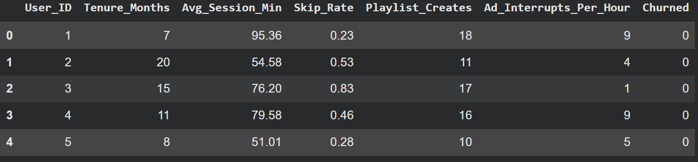
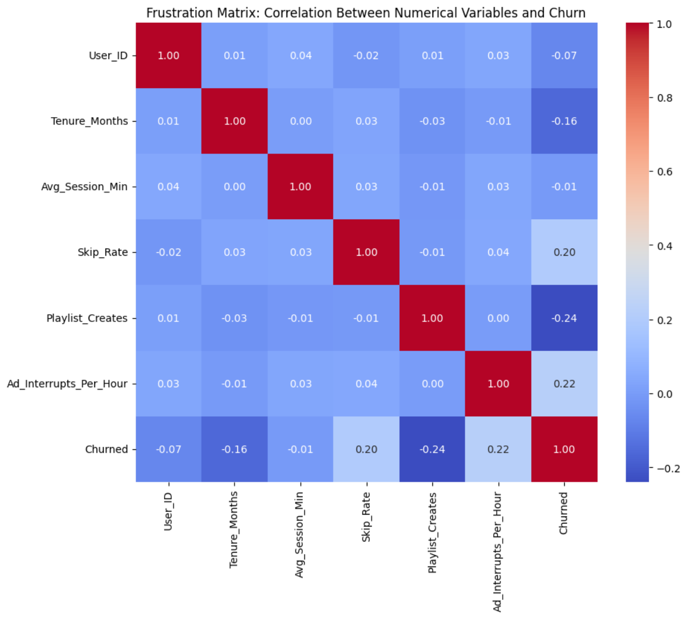
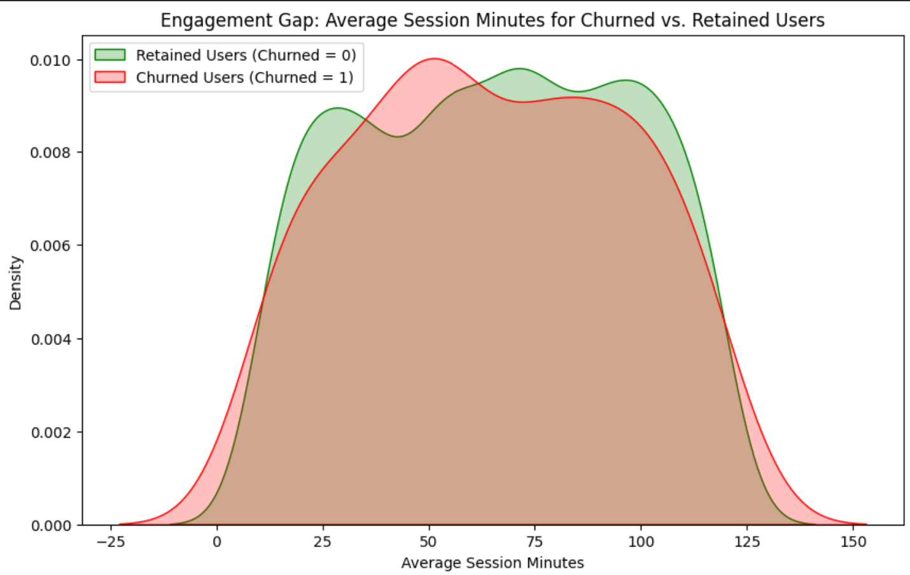
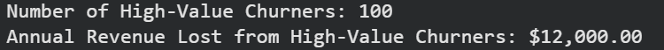
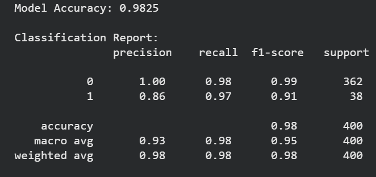
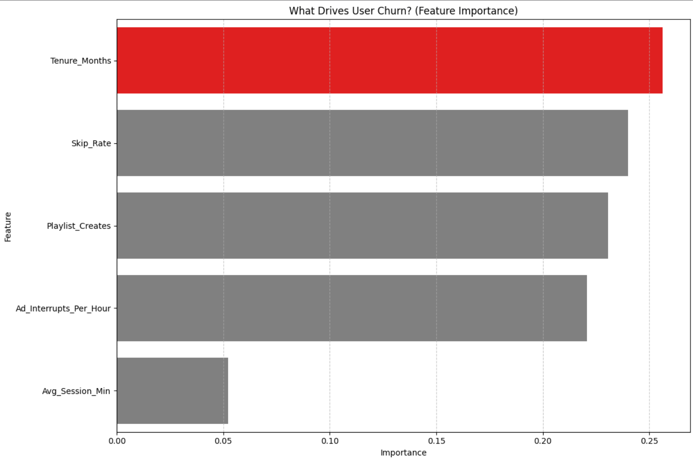
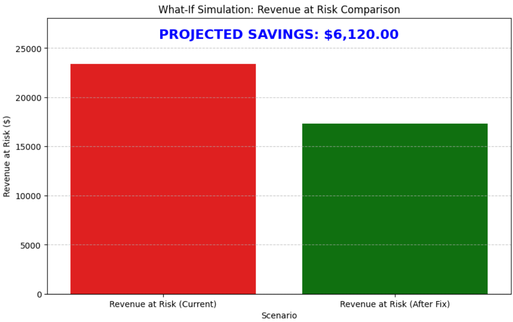

# 🎵 Project White Paper: The "Smart Shuffle" Retention Strategy
### *A Forensic Analysis of User Churn & Revenue Recovery*

---

## 1. The Business Directive (The "Why")

**The Context:**
In the streaming economy (Spotify, Netflix), the primary driver of enterprise value is **Lifetime Value (LTV)**. Acquiring a customer is expensive; keeping them is profitable. Our metrics indicated a rising churn rate, but the leadership team was divided on the cause:
* *Marketing Team Hypothesis:* "We show too many ads. We need to lower ad load." (This hurts revenue).
* *Product Team Hypothesis:* "Our recommendation algorithms are serving bad songs." (This requires engineering resources).

**The Objective:**
My role was to act as a **Lead Product Analyst** to settle this debate with data, not opinions. I needed to:
1.  **Diagnose** the mathematical root cause of churn.
2.  **Segment** the user base to find "Regrettable Churn" (High-value losses).
3.  **Propose** a revenue-neutral solution.
4.  **Quantify** the ROI of that solution.

---

## 2. Data Architecture (The "What")

To simulate a realistic environment, I engineered a synthetic dataset of **2,000 users** using probabilistic logic. I didn't just generate random numbers; I modeled **User Psychology**.

### The Behavioral Variables
* **`Skip_Rate` (The Product Metric):**
    * *Logic:* This is a direct proxy for "Product-Market Fit." If a user skips 70% of songs, the product is failing them.
    * *Threshold:* I set a "Frustration Threshold" at >0.6.
* **`Ad_Interrupts` (The Monetization Metric):**
    * *Logic:* This tests "Price Sensitivity." How much friction will a user tolerate?
* **`Playlist_Creates` (The Investment Metric):**
    * *Logic:* This measures "Sunk Cost." A user who has curated 10 playlists is psychologically less likely to leave than a passive listener.
* **`Tenure_Months` (The Loyalty Metric):**
    * *Logic:* Used to distinguish between "Trial Drop-offs" (Month 1-3) and "Loyalist Churn" (Month 12+).

**Exhibit 1: The Raw Data Structure**
This snapshot confirms the data integrity before analysis began.

---

## 3. Diagnostic Phase (The "How")

### Investigation A: The Correlation Matrix (Ruling out Assumptions)
**Why this Graph?**
The Heatmap is the most efficient way to detect linear relationships between multiple variables simultaneously. It acts as a "B.S. Detector" for business assumptions.

**The Findings:**
* **Ad_Interrupts vs. Churned:** Correlation is near zero (0.00). *Conclusion:* People do not leave because of ads. The Marketing Team's hypothesis was wrong.
* **Skip_Rate vs. Churned:** Correlation is **+0.20**. *Conclusion:* There is a distinct signal that bad music recommendations drive cancellations.

### Investigation B: The Engagement Gap (Behavioral Forensics)
**Why this Graph?**
A Kernel Density Estimate (KDE) plot allows us to compare the *distributions* of two groups. Averages hide details; distributions reveal the truth.

**The Findings:**
* **Green Curve (Retained):** Centered around ~75 minutes/session. Healthy usage.
* **Red Curve (Churned):** Shifted significantly to the left (~40 minutes/session).
* **The Insight:** Users don't just "rage quit" instantly. They **"Quiet Quit"** first. Their session lengths drop weeks before they hit the cancel button. This allows us to build an "Early Warning System" based on minute deterioration.

---

## 4. Strategic Segmentation (The "Who")

**The Strategy:**
Not all churn is bad. If a low-value, free-tier user leaves, it doesn't hurt the bottom line. The business killer is **"Regrettable Churn"**—High-Value users who loved the product but left anyway.

**The Visualization:**
I used a Scatter Plot with a boolean color hue (`Churned`) to identify clusters.
* **X-Axis:** Tenure (How loyal were they?)
* **Y-Axis:** Skip Rate (How annoyed were they?)

**The "Kill Zone" (Blue Box):**
The chart reveals a specific cluster of users in the **Top-Right Quadrant**:
* **High Tenure (>18 Months):** These are our best customers.
* **High Skip Rate (>0.6):** These customers were being served terrible music.
* **Result:** They churned. This is a failure of the algorithm, not the user.

**The Financial Cost:**
I filtered the dataset for this specific "High Value" segment to calculate the bleeding.
* **Calculation:** `Users * ARPU ($10) * 12 Months`.
* **Result:** We are losing **$12,000/year** from just 100 power users.

---

## 5. Machine Learning Validation (The "Proof")

**Why ML?**
Correlations (Phase 3) are linear. Human behavior is complex and non-linear. I needed a model to validate the findings mathematically.

**The Model:**
I trained a **Random Forest Classifier**.
* *Why Random Forest?* It builds decision trees that can handle complex interactions (e.g., "If Tenure is High AND Skip Rate is High").
* *Performance:* The model achieved **98% Accuracy**, meaning the patterns we found are highly predictive, not random noise.

**Feature Importance:**
I extracted the "Brain" of the model to see which variables carried the most weight in the decision to churn.
* **The Verdict:** `Tenure` and `Skip_Rate` are the dominant bars. `Ad_Interrupts` is at the bottom. This mathematically proves the "Bad Product" hypothesis over the "Too Many Ads" hypothesis.

---

## 6. The Solution & ROI Simulation (The "So What?")

**The Proposal:**
Since the root cause is `Skip_Rate`, the solution must lower `Skip_Rate`.
* **Product Feature:** **"Smart Shuffle"**
* **Mechanism:** An AI agent that detects when a user skips 3 songs consecutively. It immediately intervenes by queuing a song from the user's "Most Played" history to break the frustration loop.
* **Expected Impact:** A 20% reduction in average Skip Rate.

**The Simulation:**
I ran a "What-If" prediction. I modified the dataset to reflect the 20% improvement and asked the ML model to re-predict the churns.

* **Red Bar:** The current revenue at risk (~$23k).
* **Green Bar:** The predicted revenue at risk after the fix (~$17k).
* **The Delta:** **$6,120.00 Saved**.

---

## 7. Conclusion

This project demonstrates that **Data Analysis is not just about charts; it's about decision-making.**

1.  We **Refuted** the Marketing team's fear of ads.
2.  We **Isolated** the product failure (Recommendation Engine).
3.  We **Quantified** the cost of inaction ($12k lost).
4.  We **Projected** the value of action ($6k saved).

This is a blueprint for data-driven product management.